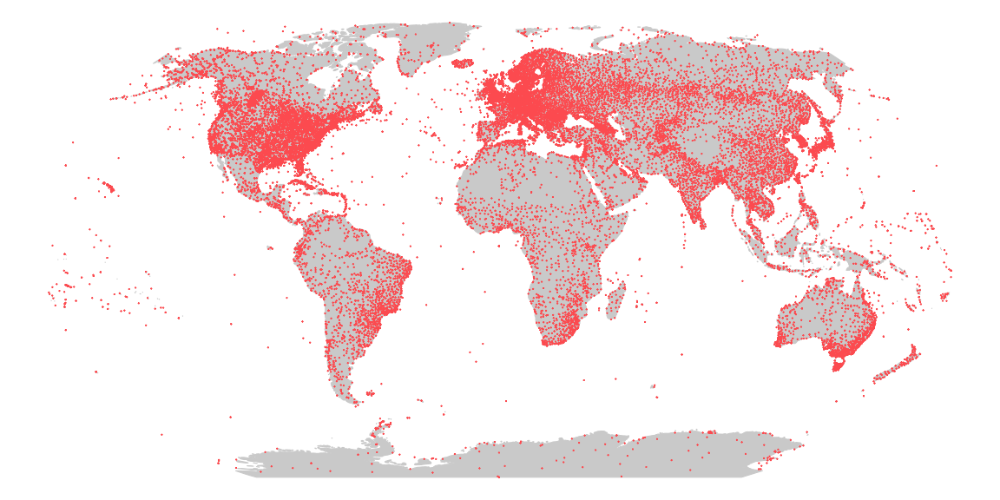

# weatheR </a>

***

This **R** package provides weather data for around 28,000 weather stations around the world. The data is provided by the National Oceanic and Atmospheric Administration's (NOAA) [Integrated Surface Data (ISD)](https://www.ncei.noaa.gov/products/land-based-station/integrated-surface-database). The package provides a function to download the data and to load it into R. The data is provided as a data frame with the following columns: `station_id`, `time`, wind direction in compass degrees `wd`, wind speed in miles per hour `ws`, cloud ceiling in hundreds of feet `ceil_hgt`, visibility in statute miles to nearest tenth `visibility`, temperature in Celsius `temp`, dew point in Celsius `dew_point`, sea level pressure in Millibars `atmos_pres`, and relative humidity `rh`. The data is provided in the [ISD-Hourly format](https://www1.ncdc.noaa.gov/pub/data/noaa/readme.txt).

This package is largly inspired by the [stationaRy](https://github.com/rich-iannone/stationaRy) packagy by Richard Iannone. Currently, the package is not updated since 2020 and can't download recent years. This package is an attempt to provide a similar package that is updated and maintained. If Richard updates his package, go over to [stationaRy](https://github.com/rich-iannone/stationaRy) as it provides more functionality.

<div style="text-align:center"></div>

## Documentation

To install and load the package, run the following code:

``` r 
devtools::install_github("hendrikmahlkow/weatheR")
library(weatheR)
```

To download all available weather stations, run the following code:

``` r
stations = download_weather_stations(save_file = FALSE)

stations
#>       station_id                    name country state icao    lat    lon   elev begin_date   end_date
#> 1   007018-99999              WXPOD 7018    <NA>    NA <NA>  0.000  0.000 7018.0 2011-03-09 2013-07-30
#> 2   007026-99999              WXPOD 7026      AF    NA <NA>  0.000  0.000 7026.0 2012-07-13 2017-08-22
#> 3   007070-99999              WXPOD 7070      AF    NA <NA>  0.000  0.000 7070.0 2014-09-23 2015-09-26
#> 4   008260-99999               WXPOD8270    <NA>    NA <NA>  0.000  0.000    0.0 2005-01-01 2012-07-31
#> 5   008268-99999               WXPOD8278      AF    NA <NA> 32.950 65.567 1156.7 2010-05-19 2012-03-23
#> # ... with 28,442 more rows
```

### Country Codes

NOAA uses FIPS 2-digit country codes. For example, in FIPS 'ES' is El Salvador, while the ISO-2 code for El Salvador is 'SV' and Spain has 'ES'. The package come with a country concordance table that matches FIPS country code to country names and ISO-3 codes. Call `country_concordance` to retrieve the data frame.

``` r
country_concordance

#>     NOAA_ccode                                 country_name country_code
#> 1           AA                                        Aruba          ABW
#> 2           AC                          Antigua and Barbuda          ATG
#> 3           AE             Abu Dhabi - United Arab Emirates          ARE
#> 4           AF                                  Afghanistan          AFG
#> 5           AG                                      Algeria          DZA
#> # ... with 245 more rows
```

Let's get the NOAA country code for Germany and filter all weather stations in Germany.

``` r
library(data.table)

# transform data.frame into data.table

country_concordance = as.data.table(country_concordance)

# filter country code
german_stations = country_concordance[country_code == "DEU", NOAA_ccode]

german_stations
#> [1] "GM" "GQ"

stations = as.data.table(stations)

# filter all German stations
station[country %in% german_stations]
#>        station_id                 name country state icao    lat     lon  elev begin_date   end_date
#>   1: 090910-99999  ARKONA (CAPE)     &      GM    NA <NA> 54.683  13.433  42.0 1975-07-01 2002-07-29
#>   2: 091610-99999  BOLTENHAGEN       &      GM    NA <NA> 54.000  11.200  15.0 1975-07-01 1991-10-31
#>   3: 091620-99999  SCHWERIN          &      GM    NA <NA> 53.633  11.417  59.0 1975-07-01 1992-05-17
#>   4: 091700-99999          WARNEMUENDE      GM    NA <NA> 54.183  12.083   4.0 1975-07-01 2001-11-21
#>   5: 091770-99999  TETEROW           &      GM    NA <NA> 53.767  12.617  46.0 1975-07-01 1991-10-31
#>  ---                                                                                                
#> 504: 999999-41406             GUAM WFO      GQ    NA PGUM 13.483 144.800  77.4 1945-08-31 1995-03-31
#> 505: 999999-41407 GUAM MARSHALL ISLAND      GQ    NA <NA> 13.467 144.250  54.9 1946-05-31 1946-12-31
#> 506: 999999-41411           GUAM OROTE      GQ    NA <NA> 13.433 144.633  24.1 1945-05-31 1948-05-29
#> 507: 999999-41414       GUAM NORTH AFB      GQ    NA <NA> 13.583 144.917 186.5 2004-07-01 2004-12-31
#> 508: 999999-41415             GUAM WFO      GQ    NA PGUM 13.483 144.800  76.2 1967-12-31 1972-12-31
```

The last rows indicate that the NOAA country code `GQ` is not explicit. It is assigned to a few German stations, e.g. `station_id = "104700-99999", name = "LEIPZIG /MOCKAU"` but also to stations in Guam.

### Closest Weather Station

To find the closest weather station to any given location us the `closest_weather_station()` function. Let's find the closest weather station to Kiel, Germany.

``` r
# Five closest weather stations to Kiel
closest_weather_station(latitude = 54.323293, longitude = 10.122765, stations, n = 5)
#>   distance   station_id                name country elev begin_date   end_date
#> 1     1831 100450-99999     KIEL/KRONSHAGEN      GM 19.0 1934-01-01 1990-03-01
#> 2     6475 100465-99999       KIEL HOLTENAU      GM 30.8 1995-08-27 2023-05-21
#> 3     6877 100460-99999 KIEL/HOLTENAU(GNVY)      GM 31.0 1929-08-01 2003-08-16
#> 4     7710 100480-99999       FRIEDRICHSORT      GM 11.0 1975-05-23 2001-09-25
#> 5    22242 100440-99999    KIEL (LGT-H/AUT)      GM 21.0 1937-08-15 2003-08-16
```

### Download and Read Weather Data

To download the data for Kiel's weather in **2022**, run the following code:

``` r
download_weather_data(
    station_id = "100465-99999",
    year = 2022, 
    dir = "temp"
    )
```

To load the data, run the following code:

``` r
read_weather_data(file = list.files("temp", full.names = TRUE))
#> # A tibble: 17,114 x 10
#>    station_id   time                   wd    ws ceil_hgt visibility  temp dew_point atmos_pres    rh
#>    <chr>        <dttm>              <int> <dbl>    <int>      <int> <dbl>     <dbl>      <dbl> <dbl>
#>  1 100465-99999 2022-01-01 00:20:00   270   6.2      152       6000     9         9         NA 100  
#>  2 100465-99999 2022-01-01 00:50:00   280   6.2      122       3300     9         9         NA 100  
#>  3 100465-99999 2022-01-01 01:20:00   270   5.1      122       9999     9         9         NA 100  
#>  4 100465-99999 2022-01-01 01:50:00   260   5.1      183       9999     9         9         NA 100  
#>  5 100465-99999 2022-01-01 02:20:00   260   5.7      183       9999     9         9         NA 100  
#>  6 100465-99999 2022-01-01 02:50:00   260   5.1      183       9999     9         9         NA 100  
#>  7 100465-99999 2022-01-01 03:20:00   260   5.1      244       9999     9         9         NA 100  
#>  8 100465-99999 2022-01-01 03:50:00   270   6.2      244       9999     9         9         NA 100  
#>  9 100465-99999 2022-01-01 04:20:00   270   5.1      244       9999     9         8         NA  93.5
#> 10 100465-99999 2022-01-01 04:50:00   260   4.6      518       9999     9         8         NA  93.5
# … with 17,104 more rows
```
